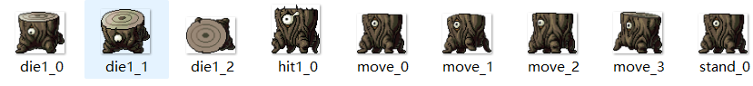

# Introduction
* This project references the library [MapleStoryAutoLevelUp](https://github.com/KenYu910645/MapleStoryAutoLevelUp) 
* It can be used with any 079 version of MapleStory available on the market. Tested versions include: wingms, mapleStoryGo.
* Please note that using automation tools/bots is against the terms of service, and I have already been banned from 3 accounts.

# Features
 * [x] Mini-map recognition (Still has issues, requires debugging)
 * [x] Character recognition 
 * [x] Monster recognition
 * [ ] Map drawing 
 * [x] Auto monster hunting
 * [x] Auto potion consumption
 * [x] Lie detector detection alarm (Requires checking the CN server's anti-cheat interface)


# 1. Character + Monster + Mini-map Recognition
## 1-1. Demo

## 1-2. Obtain Monster Assets
* [Asset Download Link](https://maplestory.wiki/GMS/83/mob/1110101)
* Download the walking frames and place them in the `monster/[downloaded_monster_name]` folder.
* It will look something like this: 
* How to adjust configurations:
  * Open `config/config_data.yaml` and locate the `mob` field.
  * Add new monster configurations. Only these three fields need to be modified, as shown in the example:
```yaml
monsters: ["black_axe_stump"]  # 指定怪物文件夹，数组可多个
diff_thres: 0.46               # 匹配阈值（越小越严格）
scales: [1]                    # 缩放比例，官方素材不匹配时改: [0.7, 0.85, 1.0, 1.15]            # 每N帧检测一次 (1=每帧, 3=流畅优先)
  ```

# 2. Map Drawing
TODO

# 3. Test Title Location Detection Separately

If you only want to verify whether `character/title.png` can locate the character without running the full AFK/farming script, you can run the following first:

```powershell
python .\test\test_title_locator.py
```

By default, it will read:

- `config/config_default.yaml`
- `config/config_custom.yaml`
- `test/test_image/screenshot.png`

And output:

- `score`
- Match status `hit=True/False`
- `title_loc`
- `player_loc`

It will also generate a debug image:

- `screenshot/title_locator_debug.png`

To use a different test image:

```powershell
python .\test\test_title_locator.py --image test\test_image\screenshot.png
```
